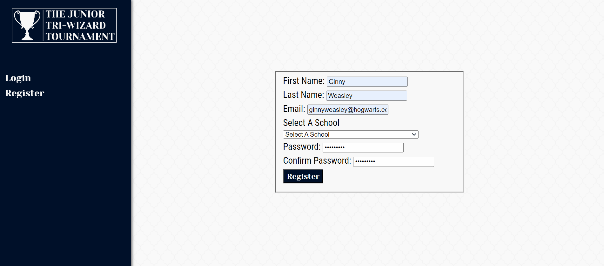
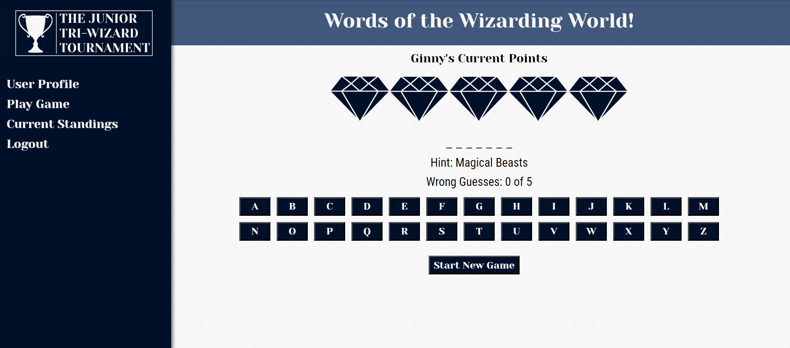
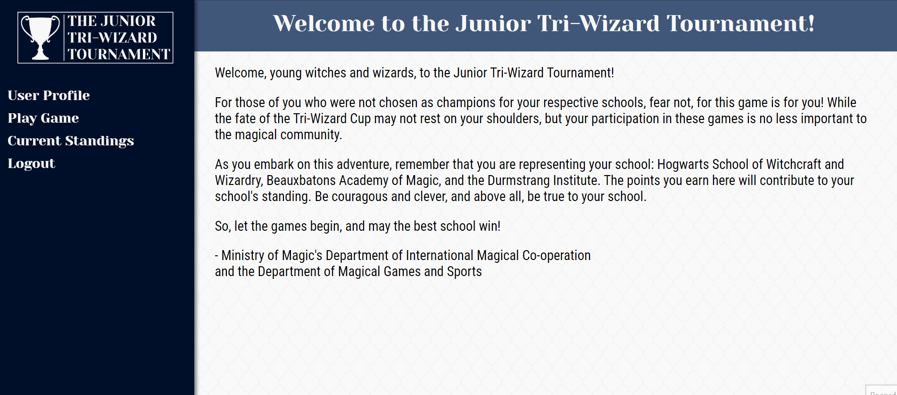

# The Junior Tri-Wizard Tournament
Introducing the Junior Tri-Wizard Tournament website, where students from Hogwarts, Beauxbatons, and Durmstrang can engage in a magical online experience with the following features:

- Registration: Sign up as a student from Hogwarts, Beauxbatons, or Durmstrang, and join the thrilling tournament.

- Customize Subjects: Choose your favorite subjects and personalize your academic journey by editing the subject list to match your magical interests.

- Profile Customization: Add an "about me" section to your profile, showcasing your unique personality and sharing interesting facts about yourself.

- Word Guessing Game: Participate in an enchanting word guessing game using your own wand, putting your magical knowledge to the test. Earn valuable points for your school with each correct answer.

- School Standings: Stay up-to-date with the current standings of Hogwarts, Beauxbatons, and Durmstrang. Witness the friendly competition between schools and see how your school ranks.

Join the Junior Tri-Wizard Tournament and experience the thrill of competition, camaraderie, and magical challenges as you represent your school! 

https://www.loom.com/share/c6ab55dd54a64b96bbeed5d5219be8d4
## Demo
- Register as a student and complete a user profile with your favorite subjects and a short bio.

- Play the game with your own wand and win points for your school.

- See which school is in the lead.

## Wireframe

## Tech Stack

- C#/.Net
- React
- VanillaJS
- JSX
- CSS

## Installation

- Clone down this repository.
- Ensure node and npm are installed on your machine.

## Project Goals
1. Build a user-friendly and visually appealing interface for participants to register, view tournament details, compete in the challenge, and view their school's current score.
1. Develop a backend system to handle user authentication, data storage, and application management.
1 .Implement a scoring mechanism to track participants' scores and calculate their school's overall performance.
1. Implement client-side routing using React to enable seamless navigation between different pages of the application.
1. Incorporate interactive features such as dropdowns, checkboxes, and buttons to enhance the user experience.
1. Integrate APIs to fetch and display dynamic data, such as game details, participant information, and leaderboard standings.

## Acknowledgements

- Special thanks go to the following: Devin - the best group leader; Hannah, Cassie, and Kaci - members of the Room of Requirement and general cheerleaders; Pritesh and Akshay - always willing to look at the code and help; Shane - Coffee & Coding buddy for life.
